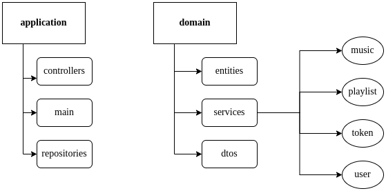
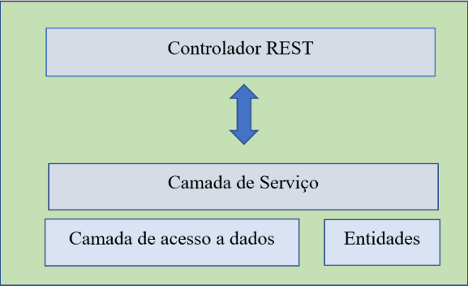

<h1 align="center">
Hi 
Welcome to Exceptions MyMusic Aplication
</h1>

<h3 align="center">
Status: Developing ⚠️
</h3>

## 🖥️ About the Project

This application derives from a legacy project, where I seek to improve it by applying microservices techniques allowing the new application to perform independent scaling of APIs, grouped according to the client's business domains. as a way to show my knowledge.! 🚀

<h3 align=center>

</h3>

## ⚙️ Architecture
The software design pattern is defined by an adaptation of MVC (Model-View-Controller) architecture concepts. As this is a strictly back-end development, the view module will not be considered during this phase. Figure 2 represents the project architecture.
<h1 align="center">
 
</h1>

To design this project we chose the MVC architecture, using DTO on the layers. The reason for this choice is that with mvc architecture we have the following benefits:
- System maintenance becomes easier;
- Reuse of code, mainly from the model layer, which can be reused in other projects;
- Easy for multiple developers to collaborate and work together;
- Easier to debug as we have multiple levels correctly written in the app;
<h1 align="center">
 
</h1>

## 📌 Features
- [X]  Authentication and authorization (Login/Logout);
- [X]  Two types of users - regular and premium account;
- [X]  Allows the user to search for songs in the database, using name of artist or song;
- [X]  Allow the user to choose the songs from the search result they want to add to their playlist;
- [X]  Allow the user to remove songs from their playlist;
- [X]  100% covered unit test cases (Jacoco);
- [X]  100% covered by functional tests;

## 🔫 Technologies and tools
- Java 11;
- Spring Boot;
- Maven;
- JPA / Hibernate;
- SQLite;
- JUnit;
- Mockito;
- JaCoCo (Java Code Coverage Library);
- Swagger;
- Heroku;
- Postman;
- Intellij IDEA;
- Git & GitHub;

<h1 align="center">
 T H A N K S !
</h1>
